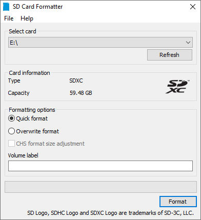
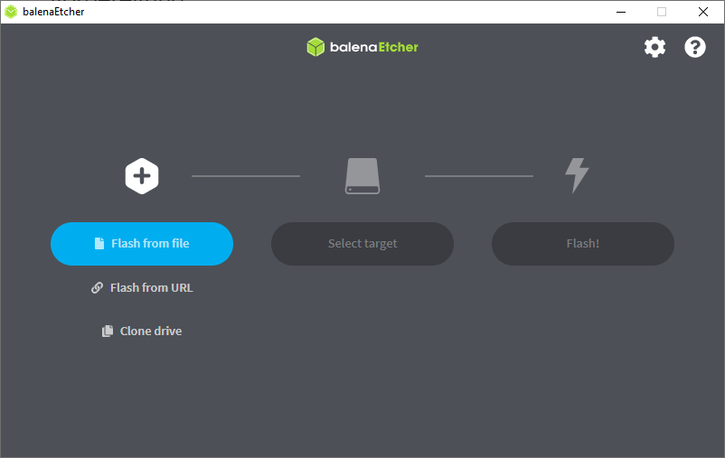
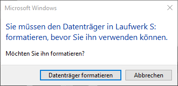
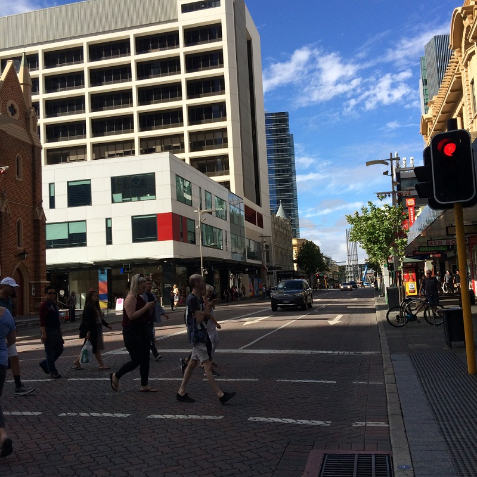
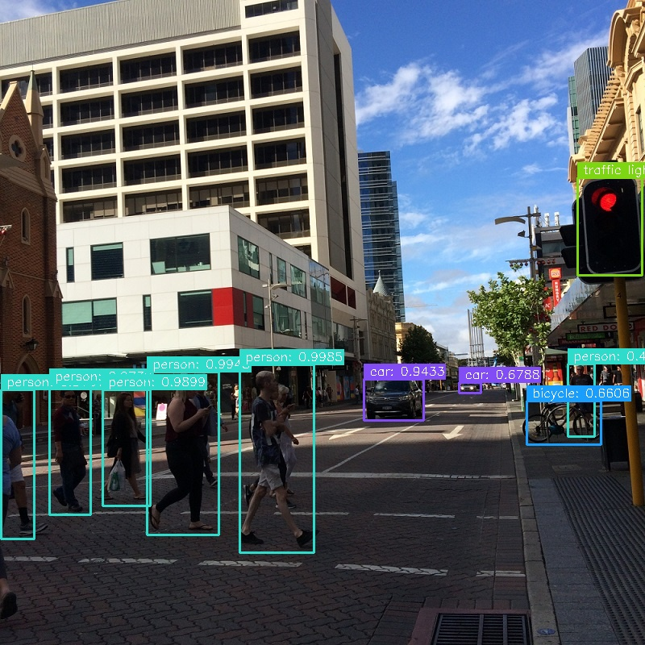
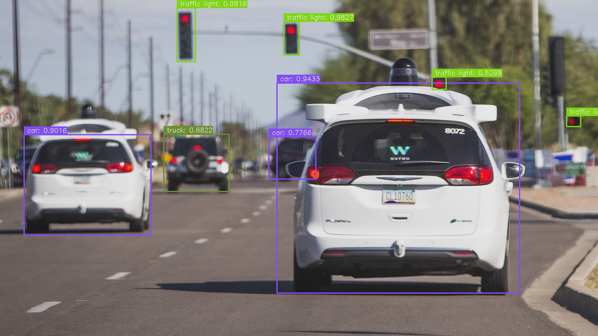
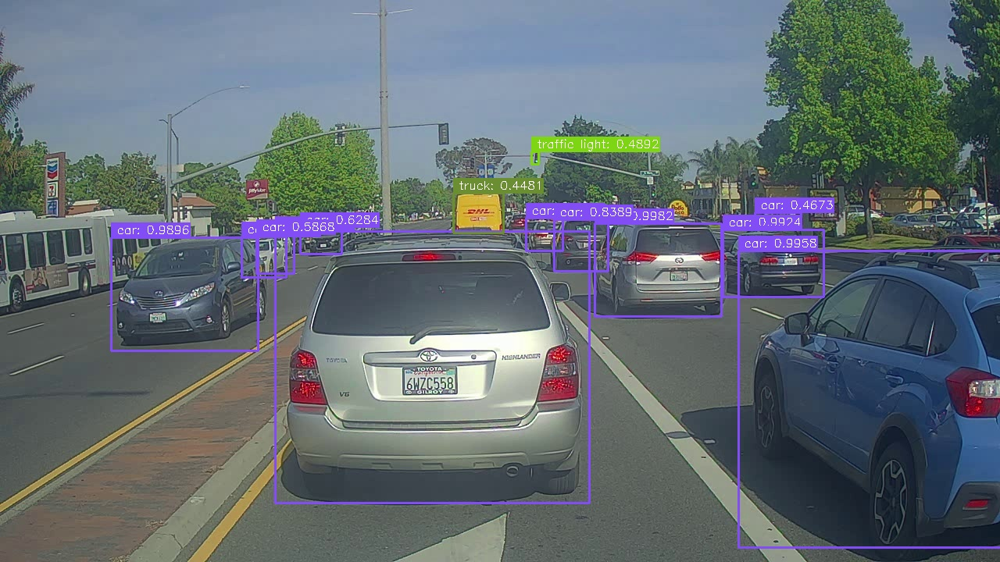

# Zusammenfassung

Diese Studienarbeit befasst sich mit der Entwicklung einer
Trainingsumgebung für autonomes Fahren mit OpenCV. Dazu wurde das Jetson
Nano von Nvidia verwendet, ein Entwicklungskit für KI und Robotik.

Ziel der Arbeit ist es eine stabile Erkennung und Klassifizierung der
Objekte Fußgänger, Auto, Fahrradfahrer und Verkehrsampel in Videostreams
zu implementieren. Dafür wird das bestehende künstliche neuronale Netz
YOLOv3 verwendet.

Um die implementierte Lösung auch in der Robotik optimal einsetzen zu
können, wurde ein Docker Container auf Basis des Roboter Operating
System (ROS) erstellt.

Performance und Genauigkeit sind wichtige Kennzahlen bei der Nutzung von
Künstlichen neuronalen Netzen (KNN). Aus diesem Grund wurden diese
Punkte genau untersucht und mögliche Verbesserungen aufgezeigt und
teilweise auch implementiert.

# Abstract

This student research project deals with the development of a training
environment for autonomous driving with OpenCV. For this purpose, the
Jetson Nano from Nvidia was used, a development kit for AI and robotics.

The goal of the project is to implement a robust recognition and
classification of the objects pedestrian, car, cyclist and traffic light
in video streams. For this purpose, the existing artificial neural
network YOLOv3 is used.

In order to be able to use the implemented solution effectively in
robotics, a Docker container based on the Robot Operating System (ROS)
was created.

Performance and accuracy are important metrics when using artificial
neural networks (ANN). Therefore, these points were closely examined and
possible improvements were pointed out and partially implemented.

# Inbetriebnahme des Jetson Nano DeveloperKits

In diesem Kapitel wird Schritt für Schritt erklärt, welche Aktionen
durchgeführt werden müssen, um das Jetson Nano Developer Kit in Betrieb
zu nehmen.

## Vorbereitung

### microSD-Karte

Das Jetson Nano Developer Kit verwendet eine microSD-Karte als
Boot-Gerät und für den Hauptspeicher. Es ist wichtig, eine SD-Karte zu
verwenden, die schnellen Speicherzugriff, ermöglicht und groß genug für
Ihre Projekte ist.

Das von Nvidia empfohlene Minimum ist eine 32GB UHS-1-Karte.

### Micro-USB-Netzteil

Sie müssen das Entwickler-Kit mit einem hochwertigen Netzteil betreiben,
das 5V⎓2A am Micro-USB-Anschluss des Entwickler-Kits liefern kann. Nicht
jedes Netzteil, das 5V⎓2A verspricht, kann dies tatsächlich leisten.

## Beschreiben der SD-Karte

Um Ihre microSD-Karte vorzubereiten, benötigen Sie einen Computer mit
Internetanschluss und der Fähigkeit, SD-Karten zu lesen und zu
beschreiben, entweder über einen integrierten SD-Kartensteckplatz oder
einen Adapter.

1.  Laden Sie das [Jetson Nano Developer Kit SD Card Image](https://developer.nvidia.com/jetson-nano-sd-card-image) herunter und merken Sie sich, wo es auf dem Computer gespeichert wurde.

2.  Schreiben Sie das Image auf Ihre microSD-Karte, indem Sie die nachstehenden Anweisungen entsprechend dem Betriebssystem Ihres Computers befolgen: Windows oder Linux.

### Beschreiben mit Windows

Formatieren Sie Ihre microSD-Karte mit dem
[SD Memory Card Formatter der SD Association](https://www.sdcard.org/downloads/formatter_4/eula_windows/).



1.  SD Memory Card Formatter für Windows herunterladen, installieren und starten

2.  Laufwerk auswählen

3.  Wählen Sie „Quick format"

4.  Lassen Sie das Feld „Volume label" leer

5.  Klicken Sie auf „Format", um die Formatierung zu starten, und auf „Ja" im Warndialog

Verwenden Sie Etcher, um das Jetson Nano Developer Kit SD Card Image auf
Ihre microSD-Karte zu schreiben.



1.  Laden Sie [Etcher](https://www.balena.io/etcher) herunter, installieren und starten Sie es.

2.  Klicken Sie auf „Flash from File" und wählen Sie das zuvor heruntergeladene gezippte Jetson Nano Developer Kit SD Card Image.

3.  Legen Sie Ihre microSD-Karte ein, falls sie noch nicht eingelegt ist.

Klicken Sie auf „Abbrechen", wenn Windows Sie mit einem Dialog wie diesem auffordert:



4.  Klicken Sie auf „Select target" und wählen Sie das richtige Gerät.

5.  Klicken Sie auf „Flash!". Wenn Ihre microSD-Karte über USB3 angeschlossen ist, wird Etcher etwa 10 Minuten brauchen, um das Image zu schreiben und zu verifizieren.

6.  Nachdem Etcher fertig ist, kann es sein, dass Windows Ihnen mitteilt, dass es nicht weiß, wie es die SD-Karte lesen soll. Klicken Sie einfach auf Abbrechen und entfernen Sie die microSD-Karte.

### Beschreiben mit Linux

1.  Laden Sie [Etcher](https://www.balena.io/etcher) herunter, installieren und starten Sie es.

2.  Klicken Sie auf „Flash from File" und wählen Sie das zuvor heruntergeladene gezippte Jetson Nano Developer Kit SD Card Image.

3.  Legen Sie Ihre microSD-Karte ein. Wenn Sie keine anderen externen Laufwerke angeschlossen haben, wählt Etcher automatisch die microSD-Karte als Zielgerät aus. Andernfalls klicken Sie auf „Change" und wählen das richtige Gerät.

4.  Klicken Sie auf „Flash!" Ihr Betriebssystem fordert Sie möglicherweise zur Eingabe Ihres Benutzernamens und Passworts auf, bevor Etcher fortfahren kann.

5.  Nachdem Etcher beendet ist, werfen Sie die SD-Karte aus.

## Einrichtung und erster Start

Es gibt zwei Möglichkeiten, mit dem Developer Kit zu arbeiten:

1.  Mit angeschlossenem Bildschirm, Tastatur und Maus.

2.  Im „Headless Mode" über eine Verbindung von einem anderen Computer.

Sie können die Ersteinrichtung auf beide Arten durchführen. Im Weiteren wird nur auf die Ersteinrichtung mit angeschlossenem Bildschirm, Tastatur und Maus eingegangen, da diese einfacher durchzuführen ist. Weitere Informationen zur Headless-Installation gibt es auf der offiziellen Nvidia Internetseite.

1.  Stecken Sie die beschriebene microSD-Karte in den Steckplatz an der Unterseite des Jetson Nano-Moduls.

2.  Schalten Sie Ihren Computerbildschirm ein und schließen Sie ihn an.

3.  Schließen Sie die USB-Tastatur und -Maus an.

4.  Schließen Sie Ihr Micro-USB-Netzteil an

5.  Das Entwickler-Kit schaltet sich ein und bootet automatisch.

### Erster Start des Jetson Nanos

Eine grüne LED neben dem Micro-USB-Anschluss leuchtet auf, sobald das Entwickler-Kit eingeschaltet wird. Beim ersten Start führt das Entwickler-Kit Sie durch die Ersteinrichtung, einschließlich:

- Lesen und akzeptieren Sie die NVIDIA Jetson Software EULA

- Auswahl der Systemsprache, des Tastaturlayouts und der Zeitzone

- Anlegen von Benutzername, Passwort und Computername

- Wählen der Größe der APP-Partition - es wird empfohlen, die vorgeschlagene maximale Größe zu verwenden.

Nach diesen Schritten ist der Jetson Nano erfolgreich eingerichtet.

# Installation der Software

1.  Laden Sie das Git-Repository [yolov3-jetson-nano](https://github.com/IHni3/yolov3-jetson-nano) als ZIP-Archiv auf den Jetson Nano herunter.

2.  Entpacken Sie das ZIP-Archiv.

3.  Öffnen Sie ein Terminal im Verzeichnis des Git-Repositories

4.  Laden Sie die [Weights-Datei](https://pjreddie.com/media/files/yolov3.weights) für YOLOv3 herunter. Diese ist aufgrund ihrer Größe nicht im Git-Repository enthalten. Es kann dazu auch folgender Terminal-Befehl verwendet werden:

```bash
wget https://pjreddie.com/media/files/yolov3.weights -P yolo
```

1.  Überprüfen Sie, ob Docker auf Ihrem Jetson Nano installiert ist, indem Sie im Terminal `docker` eintippen. Falls Docker nicht installiert ist, kann es mit dem Befehl `sudo apt-get install docker` installiert werden.

2.  Erstellen Sie einen ROS Dockercontainer mit dem Befehl:

```bash
sudo docker build -t <container-name> .
```

(Dies kann einige Minuten in Anspruch nehmen)

# Verwendung der Software

Der erstellte Dockercontainer kann mit dem Befehl:

```bash
docker run --runtime=nvidia --rm -it -v "${PWD}:/local" <container-name> "<command>"
```

ausgeführt werden. Es muss lediglich der Containername und der gewünschte Befehl eingetragen werden. Mit
`-v` wird ein Volume definiert, dadurch kann der Docker Container auf Dateien der Festplatte zugreifen. Das festgelegte Volume spiegelt den aktuellen Ordner in den Ordner /local im Docker Container. Deshalb muss beim Schrieben des Befehls immer darauf geachtet werden, den Ordner innerhalb des
Dockercontainers zu referenzieren.

Mit `--help` lassen sich alle Optionen der Anwendung ausgeben.

Die Möglichkeiten sind folgende:

```bash
    usage: main.py [-h] [-c CONFIDENCE] [-t THRESHOLD] [-m {video,image}]
                   [-o OUTPUT] [-b BATCH_SIZE] [--video-framerate VIDEO_FRAMERATE]
                   [-v] [--record-detections]
                   file

    positional arguments:
      file                  Path to image or video file

    optional arguments:
      -h, --help            show this help message and exit
      -c CONFIDENCE, --confidence CONFIDENCE
                            Minimum probability to filter weak detections
                            (default: 0.5)
      -t THRESHOLD, --threshold THRESHOLD
                            Threshold for Non-Maximum-Surpression (NMS) (default:
                            0.5)
      -m {video,image}, --mode {video,image}
                            Mode of operation: video or image (default: video)
      -o OUTPUT, --output OUTPUT
                            Output folder (default: .)
      -b BATCH_SIZE, --batch-size BATCH_SIZE
                            Batch size for inference. Only possible for video mode
                            (default: 4)
      --video-framerate VIDEO_FRAMERATE
                            Video framerate (default: 0)
      -v, --verbose         Enable verbose output (default: False)
      --record-detections   Enable detection logging (default: False)
```

Hier sind alle Schalter und Optionen für die Anwendung zu sehen.

## Oft genutzte Befehle

```bash
    docker run --runtime=nvidia --rm -it -v "${PWD}:/local" <container-name> "-m video --record-detections /local/images/video01.mp4"
```

Verarbeitung des Videos video01.mp4 mit aktivierter Detektions-Aufzeichnung.

```bash
    docker run --runtime=nvidia --rm -it -v "${PWD}:/local" <container-name> "-m image /local/images/street.jpg"
```

Verarbeitung des Bildes street.jpg.

```bash
    docker run --runtime=nvidia --rm -it -v "${PWD}:/local" <container-name> "-m image -c 0.5 -t 0.7 /local/images/street2.jpg"
```

Verarbeitung des Bildes street2.jpg mit geändertem Threshold und Confidence.

# Parameterabhängigkeiten

Mit den Schaltern `-c` bzw. `--confidence` und `-t` bzw. `--threshold` lassen sich die ergebnisse des neuronalen Netzes YOLOv3 manipulieren. Mit der Confidence lässt sich der Wert für die Genauigkeit festlegen, der minimal erreicht werden muss, um als erfolgreiche Detektion angesehen zu werden. Wird dieser zu niedrig gesetzt, werden Objekte erkannt, die es nicht gibt. Bei einem zu hohen Genauigkeitswert kann es sein, dass nichts erkannt wird. Der voreingestellte Wert 0.5 hat sich als guter Standard herauskristallisiert.

Mit dem Threshold lasst sich der Schwellwert für die Non-Maximum-Suppression des neuronalen Netzes einstellen. Damit wird verhindert, dass es zu überlappenden Bounding Boxen kommt. Das Verhalten ist in folgendem Artikel ausgezeichnet erklärt: https://learnopencv.com/non-maximum-suppression-theory-and-implementation-in-pytorch/.

Auch hier hat sich der Wert 0.5 als guter Standard bewährt.

# Performanceoptimierung

**Reduzierung der Framerate**

Über den Schalter `--video-framerate` lässt sich die Zielframerate des Videostreams anpassen. Dadurch reduziert sich
die Anzahl der verarbeiteten Bilder. Oft haben die Eingangsvideos 60 FPS, mit einer solch hohen Framerate ist es nicht möglich Videos in Echtzeit zu verarbeiten.

**Reduzierung der Bildgröße**

Eine andere Möglichkeit die Performance zu erhöhen ist die Bildgröße des Eingangsvideos auf ein Minimum zu reduzieren, dadurch kann das Preprocessing beschleunigt werden. Die Eingangsgröße von YOLOv3 ist ein Bild der Größe 416×416. Deshalb lässt sich das Preprocessing auf maximal beschleunigen, wenn das Eingangsvideo bereits diese Größe aufweist.

**Erhöhen der Batchsize**

Die letzte beschriebene Möglichkeit ist die Erhöhung der Batchsize dadurch werden auf der Grafikkarte mehrere Bilder gleichzeitig verarbeitet, dazu kann die Option `--batch-size` verwendet werden. Bei einer zu hohen Batchsize kann es zu Problemen kommen, da RAM und Grafikspeicher beim Jetson Nano eine Einheit sind und gemeinsam verwendet werden, dadurch kann es zu Speicherproblemen führen. Nach ausgiebigen Tests hat sich herauskristallisiert, dass die Batchsize
nicht höher als 16 gesetzt werden sollte ([siehe Nvidia Dokumentation](https://www.nvidia.com/de-de/autonomous-machines/embedded-systems/jetson-nano/education-projects/)).

# Mögliche Fehler

**Fehler „system throttled due to over-current"**

Wird in der Betriebssystem-Oberfläche die Fehlermeldung „system throttled due to over-current" angezeigt, bedeutet das, dass ein Netzteil mit einer zu geringen Spannung verwendet wird. Es handelt sich dabei um einen Schutzmechanismus des Jetson Nanos, dadurch wird verhindert, dass es zu einem Absturz des Boards kommt. Das Resultat ist, dass der Jetson Nano gedrosselt wird und nicht mehr die volle Systemleistung zur Verfügung steht.

**Zu hohe Batchsize**

Wurde eine zu hohe Batchsize eingestellt kann es dazu kommen, dass es bei der Allokierung des Speichers keine Fehlermeldung geworfen wird und die Applikation ohne einen Fehler anzuzeigen terminiert. Bei einer Batchsize von 64 werden bei einer Bildgröße von 1920×1080 Pixeln bereits mehr als 1.48 GiB allokiert.

# Grundlegende Beschreibung der Programmierung und Dateistruktur

## Dateistruktur

Im Repository existieren drei Ordner. Die Ordner: `images`, `src`, und `yolo`. Im Ordner `images` sind Testbilder und Videos sowie Ergebnisbilder der Anwendung gespeichert. In `src` ist die Python Programmierung der Anwendung zu finden und im Ordner `yolo` die benötigten Dateien zur Ausführung des KNNs YOLOv3.

Im Stammverzeichnis sind des Weiteren noch die für Docker benötigten Dateien hinterlegt. Das Dockerfile sowie den Einsprungpunkt in den Container `entrypoint.sh`.

## Programmierung

Einsprungpunkt in die Anwendung ist die Datei `main.py` im `src` Verzeichnis. Darin werden die Kommandozeilenargumente geparst und auf Validität geprüft. Des Weiteren wird die Verarbeitung für Videos oder Einzelbilder angestoßen.

Diese Verarbeitung befindet sich in der Datei `processing.py` darin ist die gesamte Verarbeitungspipeline implementiert. Die Einzelfunktionen für die Detektion mit YOLOv3 sind allerdings ausgelagert in die Datei
`yolo_utils.py`.

Eine weitere Datei mit Funktion, die überall verwendet, wird ist die `logging_utils.py` darin ist ein Kategoriebezogenes Logging implementiert. Es existieren die Kategorien INFO, ERROR, SUCCESS und DEBUG.

## Verarbeitungspipeline

1.  Allokation: Bei der Allokation wird der benötigte Speicher für die Bilder allokiert

2.  Bild einlesen: Bilder werden hier von der Festplatte geladen und in den zuvor allokierten Speicher geladen.

3.  Preprocessing: Bei Preprocessing werden die Bilder für die Inferenz vorbereitet YOLOv3 benötigt Bilder im Farbformat BGR und mit einem Wertebereich von 0 bis 1. Des Weiteren muss die Bildgröße 416×416 Pixel betragen.

4.  Inferenz: bei der Inferenz werden die vorverarbeiteten Bilder durch YOLOv3 verarbeitet.

5.  Postprocessing: Die aus der Inferenz resultierenden Bounding-Boxen und Klassen werden hier auf dem Bild eingezeichnet. Dabei müssen die Punkte auch auf die Ursprungsgröße des Bildes transformiert werden.

6.  Bild speichern: Am Ende wird das Ergebnisbild auf die Festplatte gespeichert.

## Beispielbilder








# Quellen und Links

Implementierungsbasis der Anwendung:
https://github.com/ChiekoN/yolov3_opencv

OpenCV Dokumentation:
https://docs.opencv.org/4.x/d6/d00/tutorial_py_root.html

Nvidia Jetson Nano Dokumentation:
https://developer.nvidia.com/embedded/learn/get-started-jetson-nano-devkit
